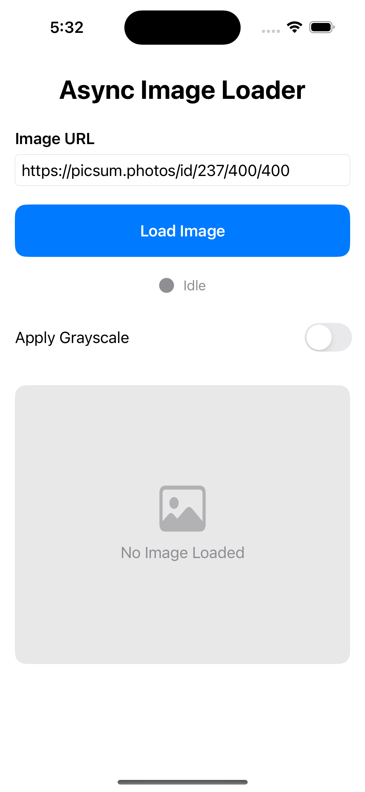
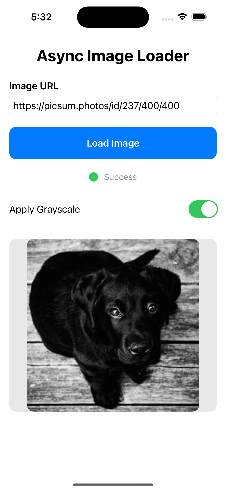
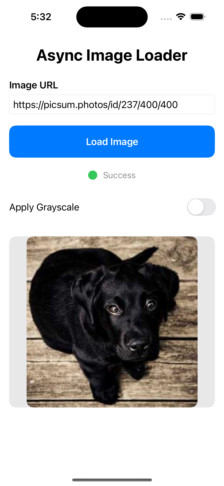
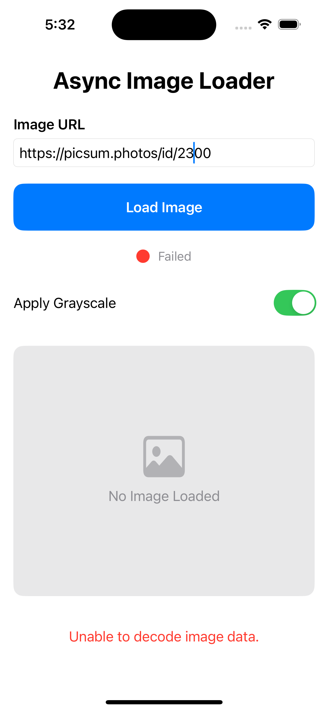

# Dynamic Image Retrieval

## Overview

**Dynamic Image Retrieval** is an iOS application that allows users to input an image URL, load the image asynchronously, and display it with options for grayscale filtering. The app handles URL validation, error handling, and provides a loading indicator while fetching the image.

## Features

- **Image URL Input**: Users can enter a valid image URL to load an image.
- **Grayscale Toggle**: A toggle switch to apply a grayscale effect to the image.
- **Error Handling**: Displays appropriate error messages if the URL is invalid, or the image loading fails.
- **Loading Indicator**: A visual progress indicator that shows when the image is being fetched.
- **Status Indicator**: A circular indicator that changes color based on the image loading status (gray, orange, green, red).
- **Asynchronous Image Loading**: Efficient asynchronous image loading using Swift's async/await functionality.

## Requirements

- Xcode 12.0 or higher
- Swift 5.5 or higher
- iOS 14.0 or higher

## Installation

1. Clone the repository to your local machine:
git clone https://github.com/HiteshMadaan28/Dynamic_Image_Retrieval.git

2. Open the project in Xcode:
- Navigate to the project directory.
- Open the `.xcodeproj` file with Xcode.

3. Build and run the project on the simulator or a physical device.

## How to Use

1. **Enter the Image URL**:
- Type or paste a valid image URL in the text field provided at the top of the screen.

2. **Load the Image**:
- Press the "Load Image" button to initiate the image loading process.

3. **Grayscale Toggle**:
- Use the "Apply Grayscale" toggle to switch between the colored and grayscale version of the image.

4. **Monitor the Status**:
- The circular indicator will show the status of the image load:
  - **Gray**: Initial/Loading
  - **Green**: Image loaded successfully
  - **Red**: Image load failed

5. **Error Handling**:
- If an error occurs, an appropriate error message will be displayed below the image area.

## Screenshots

Here are a few screenshots of the app in action:

  
  
  
  

## Contributing

Contributions to this project are welcome! If you'd like to contribute, please fork the repository and submit a pull request.

### Steps to contribute:

1. Fork the repository.
2. Create a new branch (`git checkout -b feature-name`).
3. Make your changes.
4. Commit your changes (`git commit -am 'Add new feature'`).
5. Push to the branch (`git push origin feature-name`).
6. Create a new Pull Request.

## Acknowledgments

- Swift and SwiftUI for making iOS development simple and efficient.
- Core Image for applying grayscale filters to the image.
- URLSession for fetching the image asynchronously.
